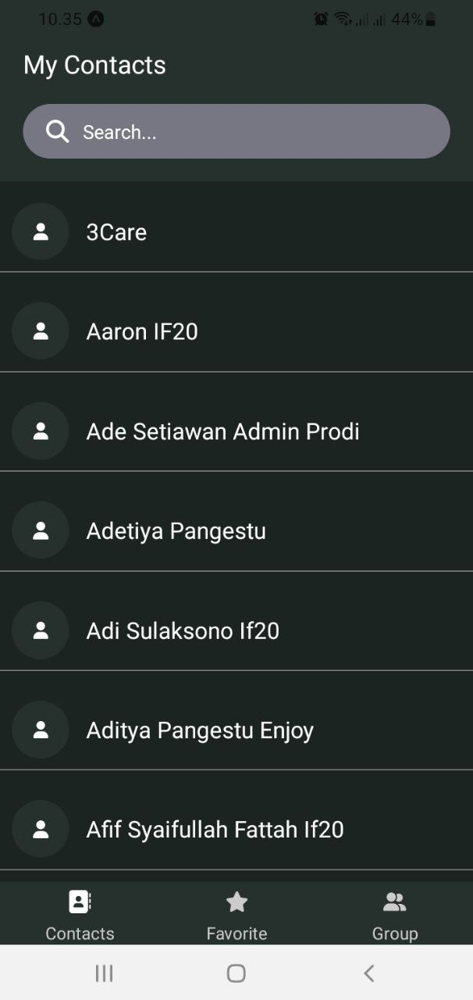
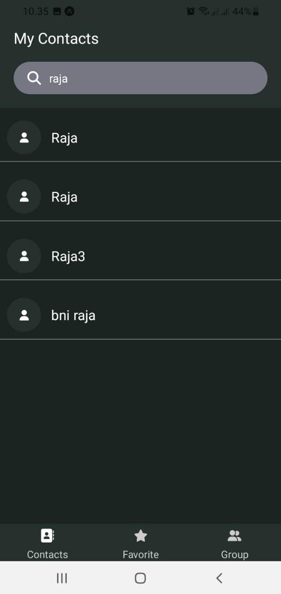
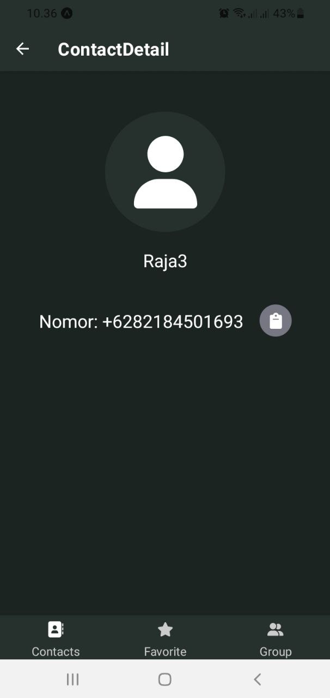
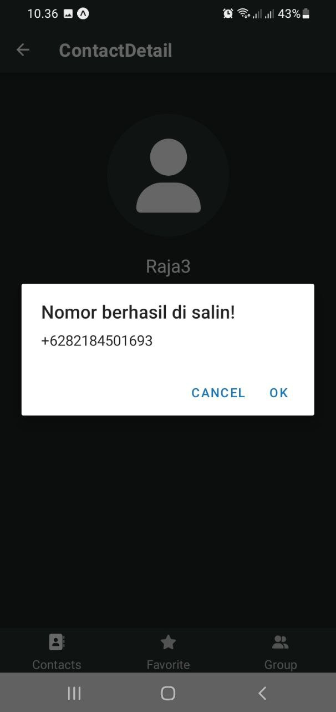

<!-- make description for this project -->
<h1 align="center"> Contact App</h1>
<h2 align="center"> UTS Pengembangan aplikasi mobile </h2>
<p>
Nama : Raja Saputera <br>
NIM : 120140228 <br>
Kelas : RA <br>
</p>

## Table of Content

- [Deskripsi Aplikasi](#deskripsi-aplikasi)
- [Daftar package yang digunakan (expo)](#daftar-package-yang-digunakan-expo)
- [Cara menjalankan aplikasi](#cara-menjalankan-aplikasi)
- [Screenshoot](#screenshoot)

## Deskripsi Aplikasi

Aplikasi ini dibuat untuk memenuhi tugas UTS mata kuliah Pengembangan Aplikasi Mobile. Aplikasi ini berfungsi untuk menyimpan kontak-kontak yang ada di ponsel. mencari kontak, dan menyalin nomor kontak di clipboard. rencana kedepannya akan ada penambahan fitur seperti menambah kontak, mengedit kontak, dan menghapus kontak.

## Daftar package yang digunakan (expo)

- fontawesome icons (https://fontawesome.com/)
- expo clipboard (https://docs.expo.io/versions/latest/sdk/clipboard/)
- expo contacts (https://docs.expo.io/versions/latest/sdk/contacts/)
- react navigation (https://reactnavigation.org/)
- redux-toolkit (https://redux-toolkit.js.org/)

## Cara menjalankan aplikasi

- Pastikan sudah mengisntal nodejs dan git
- clone repository ini
- buka terminal
- masuk ke folder project
- ketikkan perintah `npm install` untuk menginstall package yang dibutuhkan
- ketikkan perintah `npm start` untuk menjalankan aplikasi
- ### Atau bisa langsung buka terminal kemudian salin script dibawah ini
  ```bash
  git clone https://github.com/rajastra/Contact-App.git
  cd Contact-App
  npm install
  ```
- ### untuk menjalankan aplikasi
  ```bash
   npm start
  ```
- ### untuk menjalankan aplikasi di android

  ```bash
   npm run android
  ```

- ### untuk menjalankan aplikasi di ios

  ```bash
   npm run ios
  ```

- ### untuk menjalankan aplikasi di web
  app ini ketika di jalankan di web tidak akan menampikan kontak karena data kontak yang di ambil harus dari smartphone
  ```bash
   npm run web
  ```

## Screenshoot





